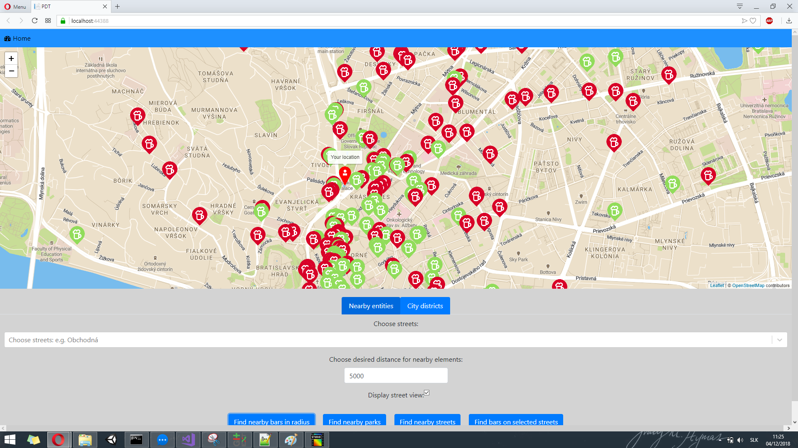
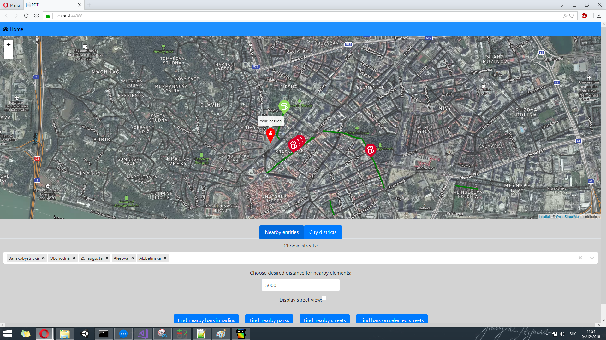

# Overview

This application shows parks, bars, different shop in Bratislava on a map. Most important features are:
1. Searching for bars and pubs in radius or in selected city district
2. Searching for parks in radius or city district
	2a. Searching for shops in close proximity of a park (shops that can be found: tobacco, alcohol, wine stores or supermarkets)
3. Searching for bars and pubs on selected streets in radius or in city district


Output of selecting a park to find it nearest shops:
	
		
Output of looking for bars in radius:
	
	
Output of looking for bars on selected streets:
	

The application has 2 separate parts, the client which is a [react application](#frontend) using leaflet API the [backend application](#backend) written in C# in ASP.NET using EntityFramework with NetTopologySuite to interact with PostGis database.  The frontend application communicates with backend using a [REST API](#api).

# Frontend

The fronted application is SPA written in React. It communicates with backend rest API using native function "fetch". The map is displayed using react component based Leaflet technology. Geographic information is displayed in GeoJSON format on Leaflet map. 

Each of the point properties has its own icon (user location, bar, pub, supermarket, tobacco shop, wine shop and alcohol store). Parks are shown as polygon in two different colours. Red for parks without benches and blue for parks with benches. Selected streets are show in single color(green).

Most of the relevant frontend code is located in Home.js along with some styling in App.scss and general layout in DefaultLayout.cs. Icons are stored in Icons folder.
Logic in frontend is very simple, its only responsibilites are
- getting user location (using web API)
- handling user input and calling appropriate REST calls
- dispalying geo features in GeoJSON format retrieved from backend

# Backend

The backend as previously mentioned is written in C#. Server uses ASP.NET framework to set up and start server. To communicate with database it uses EntityFramework along with NetTopologySouite to translate ST_ functions. For parsing geoJSONS GeoJSON.Net nuget package has been used.

## Data

Data used for this application has been retrieved from Open Street Maps and it covers Bratislava with close agglomeration. For importing data to PostGis `osm2pgsql` tool has been used. 

Spatial Indexes has been created for way properties of tables planet_osm_line, planet_osm_roads, planet_osm_point and planet_osm_polygon which has significantly improved performance. 

All GeoJSON API function return feature collection which is to be used on frontend.

## Api

**Find Bars in radius of coordinates, used in scenario 1**
`GET /api/Bars/GetBars?centerLat=48.148598&centerLon=17.107748&radius=1000`

Example query: 
```sql
SELECT bar.name, CAST(bar.id AS integer) AS "Id", ST_X(bar.way), ST_Y(bar.way), bar.amenity AS "BarType"
FROM planet_osm_point AS bar
WHERE bar.amenity IN ('bar', 'pub') AND (ST_Distance(bar.way, @__centerPoint_0) < @__radius_1)
```
**Find Bars in city districts, used in scenario 1**
`POST /api/Bars/GetBars`
Body: serialized json of array with names of city districts

Example query:
```sql
SELECT bar.name, CAST(bar.id AS integer) AS "Id", ST_X(bar.way), ST_Y(bar.way), bar.amenity AS "BarType"
FROM planet_osm_point AS bar
CROSS JOIN planet_osm_polygon AS "cityPart"
WHERE (bar.amenity IN ('bar', 'pub') AND "cityPart".name IN ('Bratislava - mestská časť Staré Mesto')) AND (ST_Contains("cityPart".way, bar.way) = TRUE)
```
**Find streets and their bars in city districts, used in scenario 3**
`POST /api/Bars/GetStreetsWithBars`
Body: serialized json of array with names of city districts

Example query: 
```sql
SELECT bar.name, CAST(bar.id AS integer) AS "Id", ST_X(bar.way), ST_Y(bar.way), bar.amenity AS "BarType"
FROM planet_osm_point AS bar
CROSS JOIN planet_osm_line AS street
WHERE (bar.amenity IN ('bar', 'pub') AND street.name IN ('Alžbetínska', 'Andreja Plávku', 'Americké námestie')) AND (ST_Distance(street.way, bar.way) <= 25)
```
**Find parks in radius of coordinates, used in scenario 2**
`GET /api/Bars/GetParks?centerLat=48.148598&centerLon=17.107748&radius=1000`

Example query:
```sql
SELECT park.name, CAST(park.id AS integer) AS "Id", park.way, TRUE AS "HasBenches", park.id
FROM planet_osm_polygon AS park
CROSS JOIN planet_osm_point AS bench
WHERE (((park.leisure = 'park') AND (ST_Distance(park.way, @__centerPoint_0) < @__radius_1)) AND (bench.amenity = 'bench')) AND (ST_Contains(park.way, bench.way) = TRUE)
ORDER BY CAST(park.id AS integer)
```
**Find parks in city districts, used in scenario 2**
`POST /api/Bars/GetParks`
Body: serialized json of array with names of city districts

Example query:
```sql
SELECT park.name, CAST(park.id AS integer) AS "Id", park.way, TRUE AS "HasBenches", park.id
FROM planet_osm_polygon AS park
CROSS JOIN planet_osm_polygon AS "cityPart"
CROSS JOIN planet_osm_point AS bench
WHERE ((((park.leisure = 'park') AND "cityPart".name IN ('Bratislava - mestská časť Staré Mesto')) AND (bench.amenity = 'bench')) AND (ST_Within(park.way, "cityPart".way) = TRUE)) AND (ST_Contains(park.way, bench.way) = TRUE)
ORDER BY CAST(park.id AS integer)
```
**Find Shops in radius of park, used in scenario 2**
`POST /api/Bars/GetNearbyShops?centerLat=48.148598&centerLon=17.107748&radius=1000&shopRadius=$000&parkId=10`
Body: serialized json of array with names of city districts

Example query:
```sql
SELECT shop.name, CAST(shop.id AS integer) AS "Id", ST_X(shop.way), ST_Y(shop.way), shop.shop AS "ShopType"
FROM planet_osm_polygon AS park
CROSS JOIN planet_osm_point AS shop
WHERE ((park.id = @__parkId_0) AND shop.shop IN ('alcohol', 'wine', 'supermarket', 'tobacco', 'coffe')) AND (ST_Distance(shop.way, park.way) < @__radius_1)
```
**Find streets in radius of coordinates, used in scenario 3**
`GET /api/Bars/GetNearbyStreets?centerLat=48.148598&centerLon=17.107748&radius=1000`

Example query:
```sql
SELECT DISTINCT street.name
FROM planet_osm_line AS street
WHERE (street.name IS NOT NULL AND street.highway IS NOT NULL) AND (ST_Distance(street.way, @__centerPoint_0) < @__radius_1)
ORDER BY street.name
```
**Find streets in city parts, used in scenario 3**
`POST /api/Bars/GetStreetsInCityParts`
Body: serialized json of array with names of city districts

Example query:
```sql
SELECT DISTINCT street.name
FROM planet_osm_line AS street
CROSS JOIN planet_osm_polygon AS "cityPart"
WHERE ((street.name IS NOT NULL AND street.highway IS NOT NULL) AND "cityPart".name IN ('Bratislava - mestská časť Staré Mesto')) AND (ST_Intersects(street.way, "cityPart".way) = TRUE)
ORDER BY street.name
```
**Retrieves all city districts, used in scenario 1,2,3**
`GET /api/Bars/GetCityParts

Example query:
```sql
SELECT DISTINCT p.name
FROM planet_osm_polygon AS p
WHERE ((p.name IS NULL OR (p.name = '')) AND ((p.name <> 'Ahoj') OR p.name IS NULL)) AND (p.boundary = 'administrative')
```
### Response

All API calls except GetNearbyStreets, GetStreetsInCityParts, GetCityParts (which returns list of strings) return geoJSON feature collection. 
